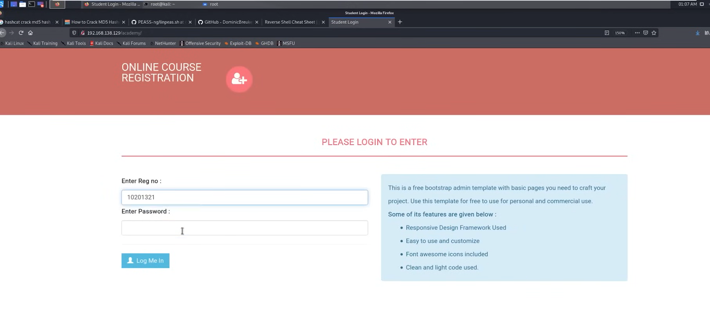
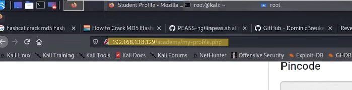
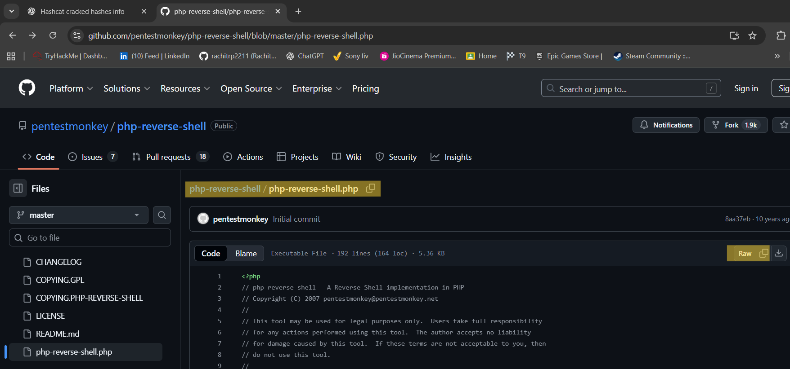
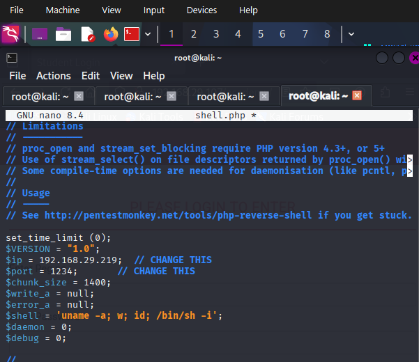
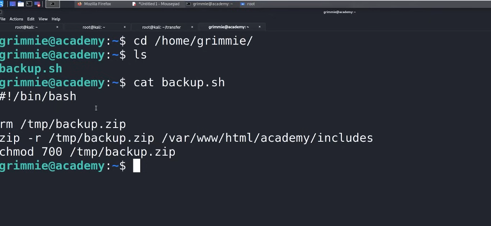
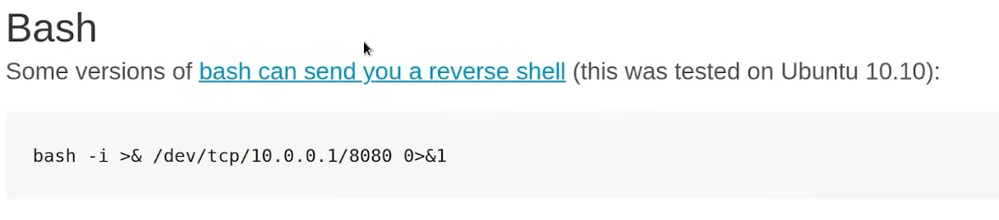
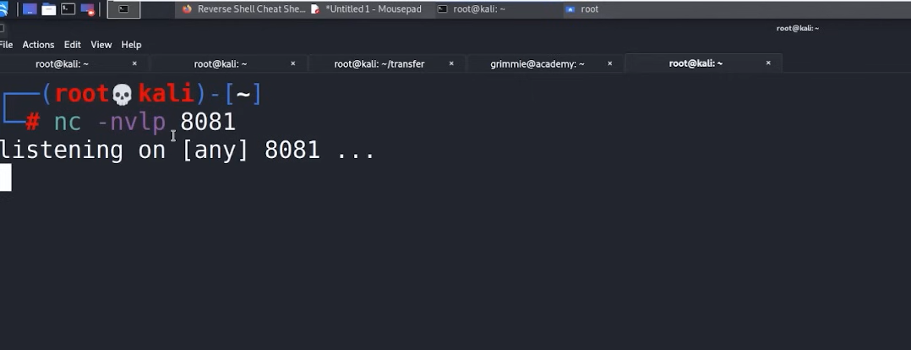

# Acadmey

# Academy

So we will Start with the Nmap scan 

```bash
──(root㉿kali)-[~]
└─# nmap -p- -T4 -A 192.168.29.107                           
Starting Nmap 7.95 ( https://nmap.org ) at 2025-12-18 18:23 IST
Nmap scan report for 192.168.29.107
Host is up (0.00076s latency).
Not shown: 65532 closed tcp ports (reset)
PORT   STATE SERVICE VERSION
21/tcp open  ftp     vsftpd 3.0.3
| ftp-syst: 
|   STAT: 
| FTP server status:
|      Connected to ::ffff:192.168.29.219
|      Logged in as ftp
|      TYPE: ASCII
|      No session bandwidth limit
|      Session timeout in seconds is 300
|      Control connection is plain text
|      Data connections will be plain text
|      At session startup, client count was 1
|      vsFTPd 3.0.3 - secure, fast, stable
|_End of status
| ftp-anon: Anonymous FTP login allowed (FTP code 230)
|_-rw-r--r--    1 1000     1000          776 May 30  2021 note.txt
22/tcp open  ssh     OpenSSH 7.9p1 Debian 10+deb10u2 (protocol 2.0)
| ssh-hostkey: 
|   2048 c7:44:58:86:90:fd:e4:de:5b:0d:bf:07:8d:05:5d:d7 (RSA)
|   256 78:ec:47:0f:0f:53:aa:a6:05:48:84:80:94:76:a6:23 (ECDSA)
|_  256 99:9c:39:11:dd:35:53:a0:29:11:20:c7:f8:bf:71:a4 (ED25519)
80/tcp open  http    Apache httpd 2.4.38 ((Debian))
|_http-server-header: Apache/2.4.38 (Debian)
|_http-title: Apache2 Debian Default Page: It works
MAC Address: 08:00:27:E8:31:E1 (PCS Systemtechnik/Oracle VirtualBox virtual NIC)
Device type: general purpose|router
Running: Linux 4.X|5.X, MikroTik RouterOS 7.X
OS CPE: cpe:/o:linux:linux_kernel:4 cpe:/o:linux:linux_kernel:5 cpe:/o:mikrotik:routeros:7 cpe:/o:linux:linux_kernel:5.6.3
OS details: Linux 4.15 - 5.19, OpenWrt 21.02 (Linux 5.4), MikroTik RouterOS 7.2 - 7.5 (Linux 5.6.3)
Network Distance: 1 hop
Service Info: OSs: Unix, Linux; CPE: cpe:/o:linux:linux_kernel

TRACEROUTE
HOP RTT     ADDRESS
1   0.76 ms 192.168.29.107

OS and Service detection performed. Please report any incorrect results at https://nmap.org/submit/ .
Nmap done: 1 IP address (1 host up) scanned in 14.63 seconds

```

now lets dig through ftp

```bash
──(root㉿kali)-[~]
└─# ftp 192.168.29.107
Connected to 192.168.29.107.
220 (vsFTPd 3.0.3)
Name (192.168.29.107:tzadok): anonymous
331 Please specify the password.
Password: 
230 Login successful.
Remote system type is UNIX.
Using binary mode to transfer files.
ftp> ls
229 Entering Extended Passive Mode (|||6872|)
150 Here comes the directory listing.
-rw-r--r--    1 1000     1000          776 May 30  2021 note.txt
226 Directory send OK.
ftp> get note.txt
local: note.txt remote: note.txt
229 Entering Extended Passive Mode (|||27394|)
150 Opening BINARY mode data connection for note.txt (776 bytes).
100% |****************************|   776      665.33 KiB/s    00:00 ETA
226 Transfer complete.
776 bytes received in 00:00 (226.68 KiB/s)
ftp> 

```

lets open the notes

```bash
──(root㉿kali)-[~]
└─# cat note.txt 
Hello Heath !
Grimmie has setup the test website for the new academy.
I told him not to use the same password everywhere, he will change it ASAP.

I couldn't create a user via the admin panel, so instead I inserted directly into the database with the following command:

INSERT INTO `students` (`StudentRegno`, `studentPhoto`, `password`, `studentName`, `pincode`, `session`, `department`, `semester`, `cgpa`, `creationdate`, `updationDate`) VALUES
('10201321', '', 'cd73502828457d15655bbd7a63fb0bc8', 'Rum Ham', '777777', '', '', '', '7.60', '2021-05-29 14:36:56', '');

The StudentRegno number is what you use for login.

Le me know what you think of this open-source project, it's from 2020 so it should be secure... right ?
We can always adapt it to our needs.

-jdelta

```

So we got some password but it is in hash also, got reg no. and we will save the hash into file 

Lets identify the hash Thorough the tool called Hash-Identifier 

```bash
┌──(root㉿kali)-[~]
└─# hash-identifier                                           
   #########################################################################
   #     __  __                     __           ______    _____           #
   #    /\ \/\ \                   /\ \         /\__  _\  /\  _ `\         #
   #    \ \ \_\ \     __      ____ \ \ \___     \/_/\ \/  \ \ \/\ \        #
   #     \ \  _  \  /'__`\   / ,__\ \ \  _ `\      \ \ \   \ \ \ \ \       #
   #      \ \ \ \ \/\ \_\ \_/\__, `\ \ \ \ \ \      \_\ \__ \ \ \_\ \      #
   #       \ \_\ \_\ \___ \_\/\____/  \ \_\ \_\     /\_____\ \ \____/      #
   #        \/_/\/_/\/__/\/_/\/___/    \/_/\/_/     \/_____/  \/___/  v1.2 #
   #                                                             By Zion3R #
   #                                                    www.Blackploit.com #
   #                                                   Root@Blackploit.com #
   #########################################################################
--------------------------------------------------
 HASH: cd73502828457d15655bbd7a63fb0bc8

Possible Hashs:
[+] MD5
[+] Domain Cached Credentials - MD4(MD4(($pass)).(strtolower($username)))

Least Possible Hashs:
[+] RAdmin v2.x
[+] NTLM
[+] MD4
[+] MD2
[+] MD5(HMAC)
[+] MD4(HMAC)
[+] MD2(HMAC)
[+] MD5(HMAC(Wordpress))
[+] Haval-128
[+] Haval-128(HMAC)
[+] RipeMD-128
[+] RipeMD-128(HMAC)
[+] SNEFRU-128
[+] SNEFRU-128(HMAC)
[+] Tiger-128
[+] Tiger-128(HMAC)
[+] md5($pass.$salt)
[+] md5($salt.$pass)
[+] md5($salt.$pass.$salt)
[+] md5($salt.$pass.$username)
[+] md5($salt.md5($pass))
[+] md5($salt.md5($pass))
[+] md5($salt.md5($pass.$salt))
[+] md5($salt.md5($pass.$salt))
[+] md5($salt.md5($salt.$pass))
[+] md5($salt.md5(md5($pass).$salt))
[+] md5($username.0.$pass)
[+] md5($username.LF.$pass)
[+] md5($username.md5($pass).$salt)
[+] md5(md5($pass))
[+] md5(md5($pass).$salt)
[+] md5(md5($pass).md5($salt))
[+] md5(md5($salt).$pass)
[+] md5(md5($salt).md5($pass))
[+] md5(md5($username.$pass).$salt)
[+] md5(md5(md5($pass)))
[+] md5(md5(md5(md5($pass))))
[+] md5(md5(md5(md5(md5($pass)))))
[+] md5(sha1($pass))
[+] md5(sha1(md5($pass)))
[+] md5(sha1(md5(sha1($pass))))
[+] md5(strtoupper(md5($pass)))
--------------------------------------------------

```

For cracking the Hash we will use Hashcat for that we need wordlist named rockyou 

we have already cracked this hash thats why we are using —show 

```bash
┌──(root㉿kali)-[~]
└─# hashcat -m 0 hash.txt --show

cd73502828457d15655bbd7a63fb0bc8:student

hashcat -m 0  hash.txt /usr/share/wordlists/rockyou.txt.gz

// This the command we have used when we have crackeed the hash //
```

We will dig some directory 

```bash
┌──(root㉿kali)-[~]
└─# ffuf -w /usr/share/wordlists/dirbuster/directory-list-2.3-medium.txt:FUZZ -u http://192.168.29.107/FUZZ

this the tool for the first level dir digging
```

And dir buster will dig all every dir and file with this we get the login page

```bash
┌──(root㉿kali)-[~]
└─# dirb https://192.168.29.107     
```



we will enter password and reg no. and log in 

we can also check the version for more vulnerability from nmap scan

 


we got the upload option in profile section and we will try to upload the malicious code through it 



we know that its an php we will dig in google 


we will upload reverse shell 



we will copy the raw file 

then paste it here in nano and named that file shell.php



change this ip to your attacker ip and port in the pasted file 

we need the listener ready


Now we will upload this file to website check the listening port we got the connection 


but we didn't get into this as root user so lets get the root user privilege 

from linpeas [https://github.com/carlospolop/privilege-escalation-awesome-scripts-suite/tree/master/linPEAS](https://github.com/carlospolop/privilege-escalation-awesome-scripts-suite/tree/master/linPEAS) we will copy the raw file and make make a file in our machine and paste it  

LinPEAS

 is a **post-exploitation enumeration tool** used on Linux systems to find **privilege escalation vectors** It automatically checks the system for **misconfigurations, weak permissions, vulnerable services, and credentials**

LinPEAS looks for things like **SUID binaries, writable files, cron jobs, kernel vulnerabilities, and stored passwords** It highlights high-risk findings using

project.


now we will run the python server to send our linpeas file to web page

Now we will dump the [linpeas.sh](http://linpeas.sh) file in port we have open using the shell.php


so it has our [linpeas.sh](http://linpeas.sh) file lets execute this file 


we are looking for red

we have an red yellow background here we will save it


we got the password

lets look into file


we got into Grimmie machine with this password


it has only one file 



we will also check for the corntab 

Crontab is a Linux scheduling service used to run commands or scripts automatically at fixed intervals.

In cyber security, misconfigured crontabs can lead to privilege escalation.

If a cron job runs as root and executes a writable script, an attacker can modify it to gain root access.

Cron jobs are commonly checked during post-exploitation using tools like LinPEAS.

Common locations include /etc/crontab, /etc/cron.d/, and user crontabs.

Example command:

```
crontab -l

```


So we need to confirmation that this backup file is running on an any time it coz we are going to modify the file run our script this thing can performed my an tool called pspy

pspy is a Linux enumeration tool used during post-exploitation to monitor running processes without root permissions.

It detects cron jobs, scheduled tasks, and background processes as they execute in real time.

pspy helps identify processes running as root that execute writable scripts or binaries.

It is commonly used to find privilege escalation opportunities related to cron jobs and automation.

pspy does not require installation or root access to run.

 And now we will save pspy file in our folder then transfer it to the grimmie machine we have our python3 running


it shows all the process running on the system 

and  we got it it is running every minute on the system now we will abuse this in our favor 


it is one line reverse_shelll



set up our reverse shell listener



we will paste this into [backup.sh](http://backup.sh) in the grimmie machine


So after a min this execute this script then we will get connection as root user


we got out connection as root user

## dnsrecon

dnsrecon is a DNS enumeration tool used to gather information about a domain. It helps discover subdomains, DNS records, and misconfigurations. dnsrecon can perform brute-force subdomain enumeration and zone transfer checks. It is used during the reconnaissance phase of penetration testing. The output helps identify attack surface like hidden subdomains or internal hosts.

tty shell

A TTY shell is a fully interactive terminal shell obtained after upgrading a basic shell. Basic shells lack job control, tab completion, and proper signal handling. Upgrading to a TTY shell improves command execution and stability. Commonly achieved using Python, script, or socat during post-exploitation.

Example command:

```
python3 -c'import pty; pty.spawn("/bin/bash")'

```